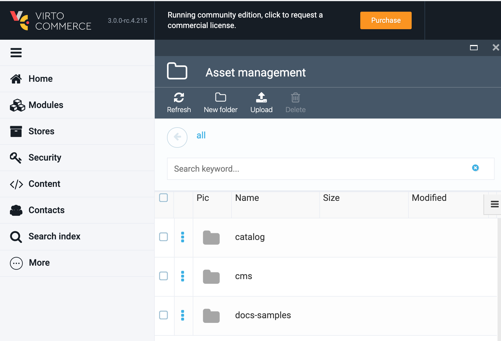

# Overview

The *Assets* function is a basic feature of Virto's Platform. Technically, it is an abstraction or an internal programming interface that helps work with the Platform file system.

***Note:*** *You cannot work with the Platform files directly; the only way to do so is through the Assets abstraction.*

The Assets programming interface allows you to:

1. Upload files
2. Read files
3. Search files

Asset Management also has a user interface that constitutes File Manager or File Dictionary. All Platform modules have access to this dictionary through the programming interface, and all folders in Assets are created with Platform modules.
Each Platform module works with its own folder located in Assets.

Asset Management can be implemented both on a physical disc or on Azure Blob Storage.



## Uploading a File to Asset Management

To upload a file, select a folder from the list of assets (e.g., Catalog) and then click the *Upload* button, as the screen capture below shows:


You can upload the file using one of the following ways:

1. Drag and drop the file
1. Browse the file
1. Enter an external URL for the file

***Note:*** *You cannot upload your file intro the root.*

## Asset Modules

There are three modules that provide the Asset feature to the Platform:

1. [vc-module-assets](https://github.com/VirtoCommerce/vc-module-assets): Provides basic infrastructure for asset storage and includes core assets abstractions, base provider class, and UI elements.
2. [vc-module-azureblob-assets](https://github.com/VirtoCommerce/vc-module-azureblob-assets): Provides Azure Blob Storage implementation.
3. [vc-module-filesystem-assets](https://github.com/VirtoCommerce/vc-module-filesystem-assets): Provides File System implementation.

## Known Limitations
1. **Azure Blob** - Folder Created and Modified Dates are loaded from Container. Because there is no folder option.
2. **File Storage on Linux** - Both Created and Modified Dates refer to the modify time (which is preserved if the file is copied).


## Configuration

To switch between the implementations, follow these steps:

1. Open **appsettings.json** for the Virto Commerce Platform instance.
2. Navigate to the **Assets** node:
3. 
```json
    "Assets": {
        "Provider": "FileSystem",
        "FileSystem": {
            "RootPath": "~/assets",
            "PublicUrl": "http://localhost:10645/assets/"
        },
        "AzureBlobStorage": {
            "ConnectionString": "",
            "CdnUrl": ""
        }
    }
```
3. Modify the following settings:
    - Set the **Provider** value to **FileSystem** or **AzureBlobStorage**
    - Provide **ConnectionString** in case you are going to use the **AzureBlobStorage** implementation option
